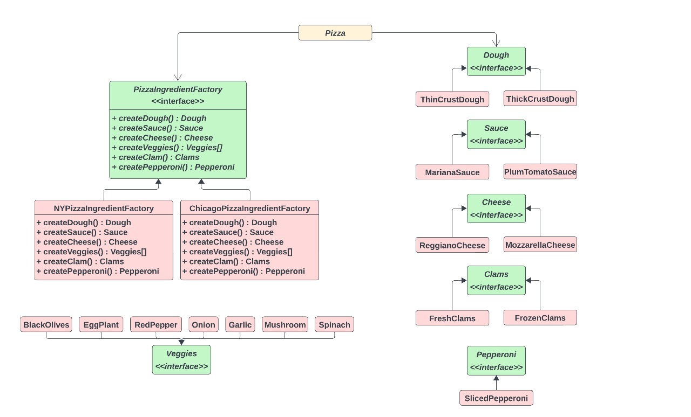
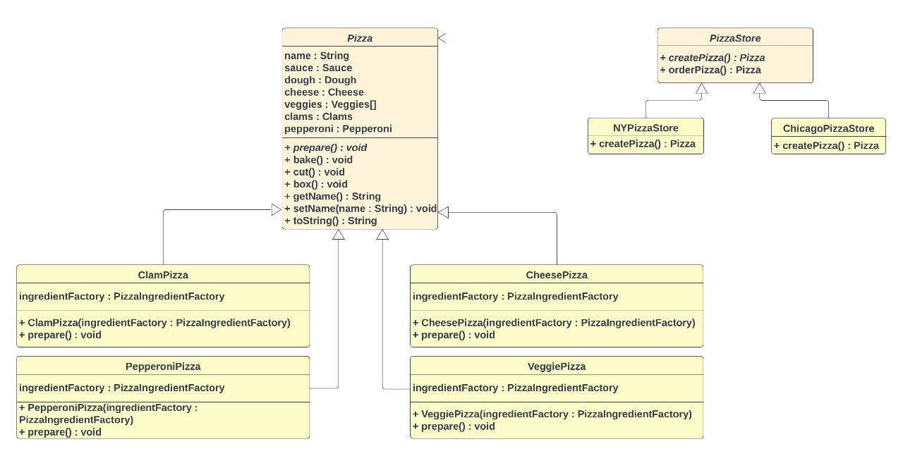

# Abstract Factory Pattern

## Definition:

The Abstract Factory Pattern provides an interface for creating
families of related or dependent objects without specifying their concrete classes.

## The Abstract Factory pattern is related to the Factory Method pattern in principles and problem, but the solution to problem is different.Let us talk about the differences between them.

### Abstract Factory:

The intent of Abstract Factory is to create **families** of related
objects without having to depend on their concrete classes.

### Method Factory:

Define an interface for creating **an object**, but
let subclasses decide which class to instantiate.

### Both of these new patterns encapsulate object creation and lead to more decoupled, flexible designs.

## Some notes about this pattern:

-- Abstract Factory relies on object composition: object creation
is implemented in methods exposed in the factory interface. 
-- The intent of Abstract Factory is to create families of related
objects without having to depend on their concrete classes. 
-- All factory patterns promote loose coupling by reducing the
dependency of your application on concrete classes. 
-- The Dependency Inversion Principle guides us to avoid
dependencies on concrete types and to strive for abstractions. 
-- Factories are a powerful technique for coding to
abstractions, not concrete classes. 

## Let's take an example(Pizza Store) of the Abstract Factory:

### UML Diagram:

### Details About Pizza store using the Abstract Factory:

-- We have an abstract class named **PizzaStore** that has two methods: orderPizza() (concrete) and createPizza() (an abstract method that is overridden in classes**NYPizzaStore and ChicagoPizzaStore**that extend from PizzaStore). Within this class, there's a method called createOrder(String type). In this method, we create a new object based on the type of pizza the customer has ordered. We then return this object to pizza Object pizzaOrder() and proceed to call the prepare(abstract method), bake, cut, and box methods. 
-- We have an abstract class called 'Pizza' that contains methods such as prepare,bake, cut, and box.It also has variables for sauce, dough, cheese, clams, veggies (an array), pepperoni, and a name for this pizza. 
-- In the NYPizzaStore and ChicagoPizzaStore classes, there is a method called createPizza(String type) which has different pizza types (cheesePizza(), pepperoniPizza(), clamsPizza() and VeggiePizza()). Based on the type specified, we instantiate an object of(cheesePizza(), pepperoniPizza(), clamsPizza() or VeggiePizza()). 
-- We have an interface class named PizzaIngredientFactory that contains several methods, including createSauce(), createDough(), createPepperoni(), createVeggies(), createCheese(), and createClams(). 
-- Ingredient:
1)we have an interface class named Sauce that is implemented by MarinaraSauce and PlumTomatoSauce. 
2)we have an interface class named Dough that implements by ThinCrustDough and ThickCrustDough. 
3)we have an interface class named Cheese that is implemented by ReggianoCheese and MozzarellaCheese. 
4)we have an interface class named Clams that is implemented by FreshClams and FrozenClams. 
5)we have an interface class named Pepperoni that is implemented by
SlicedPepperoni. 
5)we have an interface class named Veggies that is implemented by
BlackOlives, Eggplant, RedPepper, Onion, Garlic, Mushroom and Spinach. 
-- **The NYPizzaIngredientFactory and ChicagoPizzaIngredientFactory** classes implement the PizzaIngredientFactory interface. These classes have methods that are used to instantiate objects based on the type of pizza, such as cheesePizza(), pepperoniPizza(), clamsPizza(), or VeggiePizza(). 
-- We return to the createPizza() method, which is overridden by the NYPizzaStore and ChicagoPizzaStore classes. In these classes, we create a NYIngredientFactory in the NYPizzaStore and a ChicagoIngredientFactory in the ChicagoPizzaStore, passing it as a parameter for cheesePizza(IngredientFactory), pepperoniPizza(IngredientFactory), clamsPizza(IngredientFactory), or VeggiePizza(IngredientFactory). 
