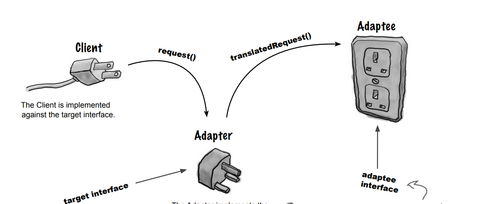
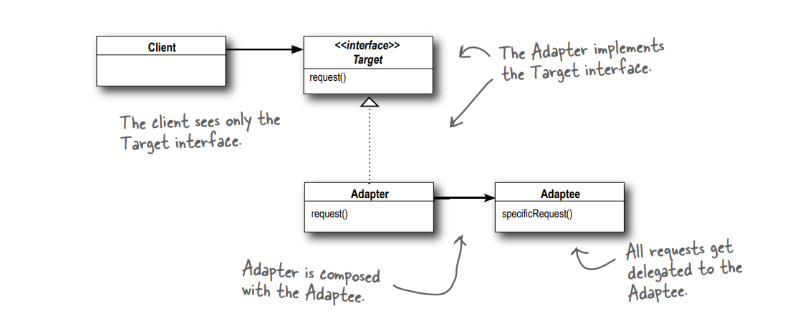
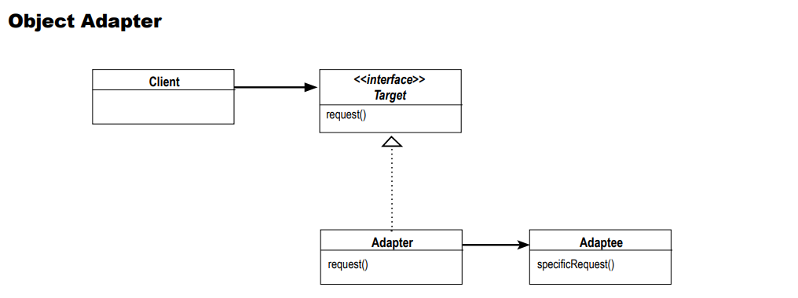
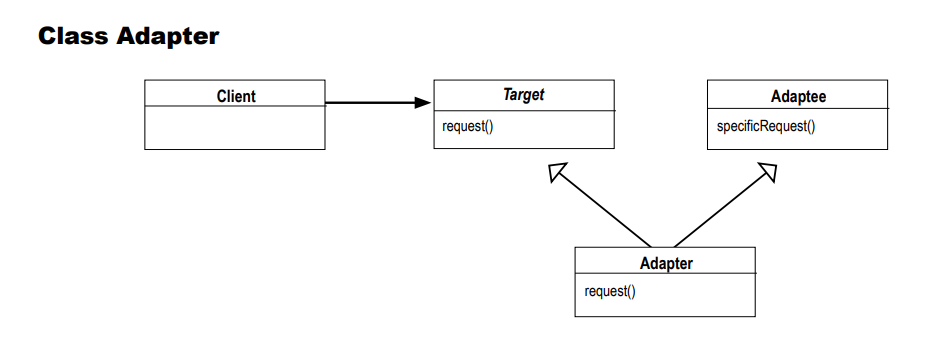
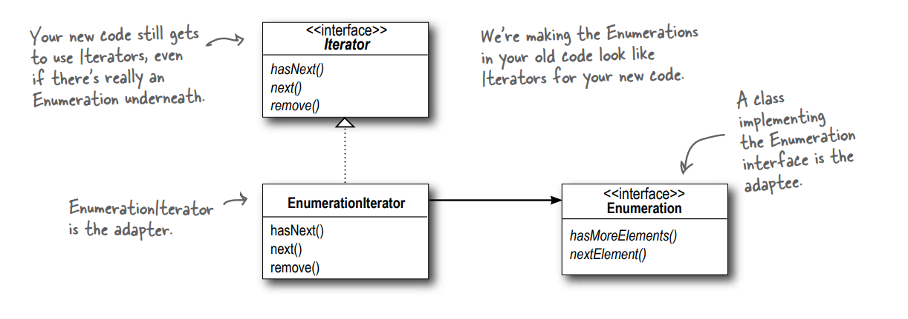

# Adapter Design Pattern

## Definition:

The Adapter Pattern converts the interface of a class into another interface the clients expect. Adapter lets classes work together that couldn’t otherwise because of incompatible interfaces.

## When to use?

-- Working with a new interface(incompatible). 
-- Classes with different implementation but do the same job. 
-- Adapting something(adaptee) to be suitable for doing the work in general without changing the client or changing the old interface. 

## Some notes about this pattern:

-- When you need to use an existing class and its interface is not the one you need, use an adapter. 
-- An adapter changes an interface into one a client expects. 
-- Implementing an adapter may require little work or a great deal of work depending on the size and complexity of the target interface. 
-- There are two forms of the Adapter Pattern: object and class adapters. Class adapters require multiple inheritance. 
-- An adapter wraps an object to change its interface. 

## An illustrative diagram for this pattern:

## The general UML diagram for the Adapter Pattern(object adapter):

## let us talk about the difference between object and class adapter:

### object adapter:

Depend on composition and we must implement all methods in target because the target is an interface.

#### The general UML diagram for object adapter:

### class adapter:

Depend on inheritance and you can override methods that you need.

#### The general UML diagram for class adapter:

## Let's take an example(convert the Iterator to an Enumeration) about the Command design pattern:

### The UML Diagram For this example:

### The details About this example:

-- We have the Iterator interface (target) which defines several methods, including hasNext(), next(), and remove(). 
-- And we have the enumeration interface(adaptee) which defines several methods,
including hasMoreElements() and nextElement(). 
-- The role of the adapter is to convert the target into an adaptee. In this case, we have the EnumerationIterator class, which serves as an adapter. This adapter (EnumerationIterator) implements all the methods defined in the Iterator (target) interface. 
-- How do I actually convert iterator to an Enumeration? 
-- ans: We create an object of type Enumeration within the adapter (EnumerationIterator). In the hasNext() method, we invoke object (of type Enumeration)'s hasMoreElements() method, and in the next() method, we call object.nextElement(). 
-- And we have a method that we do not need, but we must implement it, so we throw an exception in it.
