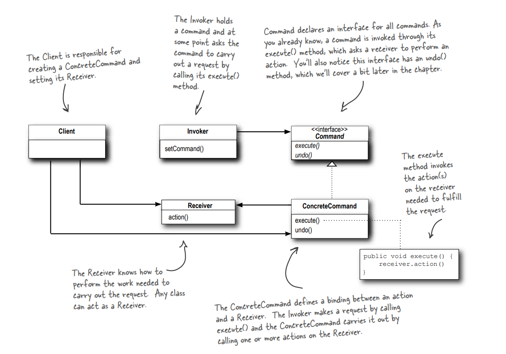
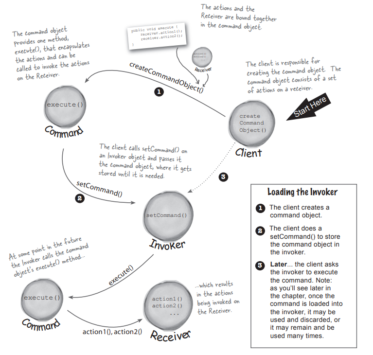
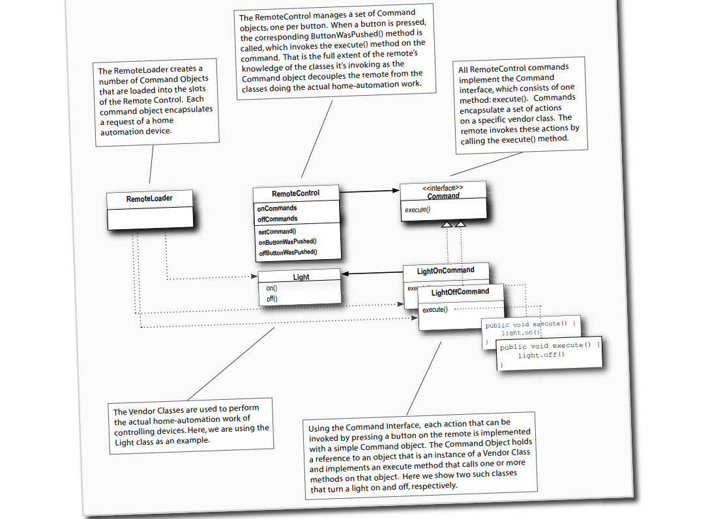

# Command Design Pattern

## Definition:

The Command Pattern encapsulates a request as an object, there by letting you parameterize other objects with different requests, queue or log requests, and support undoable operations. 

## when to use?

Encapsulating a request in an object. 
Decouple sender from processor or receiver. 
Undo operation. 
When we have too much functionality within a class. 

## The UML diagram for the Command Pattern is shown below:

## How does the Command pattern work during runtime?

## Some notes about this pattern:

-- The Command Pattern decouples an object, making a request from the one that knows how to perform it. 
-- A Command object is at the center of this decoupling and
encapsulates a receiver with an action (or set of actions). 
-- An invoker makes a request of a Command object by calling
its execute() method, which invokes those actions on the receiver. 
-- Invokers can be parameterized with Commands, even
dynamically at runtime. 
-- Commands may support undo by implementing an undo method that restores the object to its previous state before the execute() method was last called. 
-- Macro Commands are a simple extension of Command that allow multiple commands to be invoked. Likewise, Macro Commands can easily support undo(). 
-- In practice, it is not uncommon for “smart” Command objects to implement the request themselves rather than delegating to a receiver. 
-- Commands may also be used to implement logging and
transactional systems. 

## Let's take an example(remote Control) of the Command design pattern:

### The UML Diagram For this example:

### Let's look at another UML diagram:

``### Details About the Remote Control:
