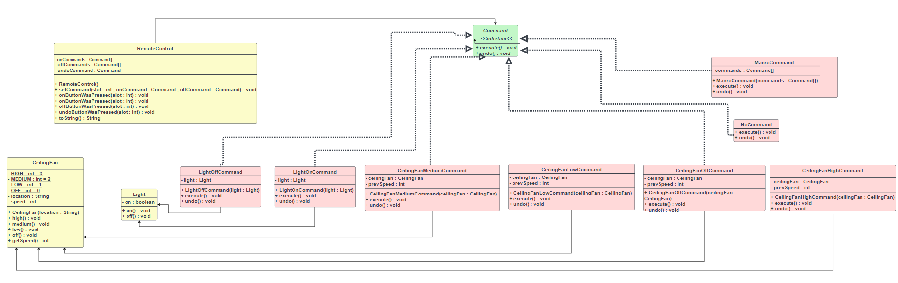

# Command Design Pattern

## Definition:

The Command Pattern encapsulates a request as an object, there by letting you parameterize other objects with different requests, queue or log requests, and support undoable operations. 

Command pattern --> invoker + sender + receiver + client.

## when to use?

Encapsulating a request in an object. 
Decouple sender from processor or receiver. 
Undo operation. 
When we have too much functionality within a class. 

## The UML diagram for the Command Pattern is shown below:

## How does the Command pattern work during runtime?

## Some notes about this pattern:

-- The Command Pattern decouples an object, making a request from the one that knows how to perform it. 
-- A Command object is at the center of this decoupling and
encapsulates a receiver with an action (or set of actions). 
-- An invoker makes a request of a Command object by calling
its execute() method, which invokes those actions on the receiver. 
-- Invokers can be parameterized with Commands, even
dynamically at runtime. 
-- Commands may support undo by implementing an undo method that restores the object to its previous state before the execute() method was last called. 
-- Macro Commands are a simple extension of Command that allow multiple commands to be invoked. Likewise, Macro Commands can easily support undo(). 
-- In practice, it is not uncommon for “smart” Command objects to implement the request themselves rather than delegating to a receiver. 
-- Commands may also be used to implement logging and
transactional systems. 

## Let's take an example(remote Control) of the Command design pattern:

### The UML Diagram For this example:

### Let's look at another UML diagram(UML diagram with additional details):

### Details About the Remote Control:

-- In this example I will define everything like which Invoker, client(Sender), Command and receiver. 
Client(sender) ==> loadRemote class(Main) 
Invoker ==> RemoteControl class. 
Receiver ==> CeilingFan and Light classes. 
Commands ==> All different Command classes: 
CeilingFanHighCommand, CeilingFanMediumCommand, CeilingFanLowCommand,CeilingFanOffCommand, LightOnCommand, LightOffCommand, NoCommand and
MacroCommand. 
-- So, the Command interface has two methods: execute() and undo(). 
-- And all command classes that have implemented all methods in the Command interface. 
-- And we have a CeilingFan (Receiver) class that includes details for the fan's settings: high, medium, and low, as well as the off state. 
-- The Light class is similar to the CeilingFan class. 
-- So, we can conclude that receivers --> devices. 
-- In every Command class, we will create an object based on the command type (**CeilingFan**LowCommand or **Light**OffCommand). 
-- For more details, in the execute method, we will call a state that specifies this Command for example in LightOffCommand class in execute method in this class we will call off state. 
-- up Until now, I have been discussing the execute method. Now, let's talk about the undo() method. In the execute method, we will store the current state, and we will call it in the undo method. 
-- And we have RemoteControlWithUndo class that has some methods including
setCommand(), onButtonWasPress(), offButtonWasPress() and undoButtonWasPress(). 
-- We will execute based on the type of button pressed. 
