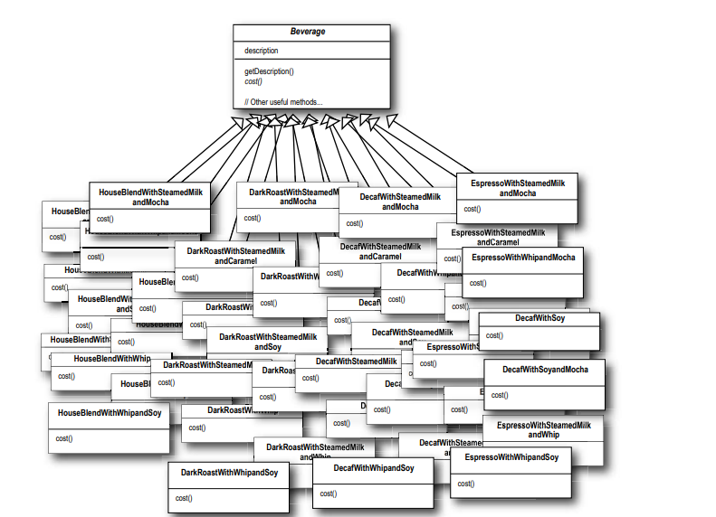
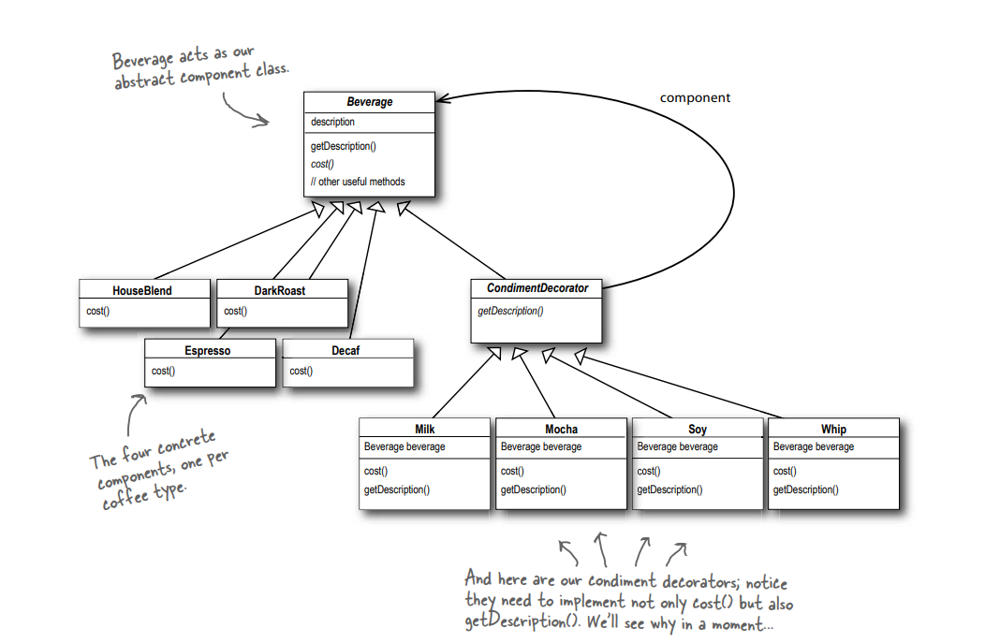
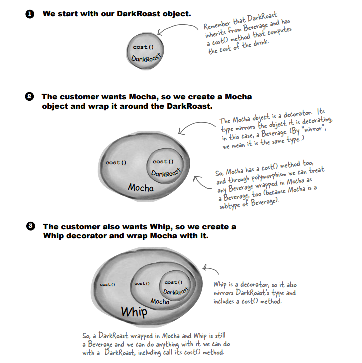

# Decorator Design pattern

## Definition:

attaches additional responsibilities to an object dynamically.
Decorators provide a flexible alternative to subclassing for extending functionality

## The reason to use Decorator Design pattern:

let is take an example (Coffee shop):
This shop has some beverages: Espresso, Decaf, Dark Roast, House Blend, and Tea.
You can order Tea, Decaf coffee, Espresso, and so on.
Till now, there has been no problem with the System.
This Shop will be add some condiments: Milk, Mocha, Soy and Whip.
The customer placed a special order for an Espresso covered with milk, mocha, and soy.
Another CUstomer ......... Espresso cover with double Milk , double mocha and double Whip.
Another CUstomer ......... Decaf cover with double Milk and soy.
And so on...
The number of probability orders has increased significantly.
We have a big problem there.
In this case, create a class for a new special order so UML Diagram:

Decorator Pattern will solve this problem.
So, it is necessary to use the Decorator Design Pattern.

## Some notes about this pattern:

-- Inheritance is one form of extension, but not necessarily the best way to achieve flexibility in our designs. 
-- In our designs we should allow behavior to be extended without
the need to modify existing code. 
-- Composition and delegation can often be used to add new
behaviors at runtime. 
-- The Decorator Pattern provides an alternative to subclassing for extending behavior. 
-- The Decorator Pattern involves a set of decorator classes that are used to wrap concrete components. 
-- Decorator classes mirror the type of the components they decorate. (In fact, they are the same type as the components they decorate, either through inheritance or interface implementation.) 
-- Decorators change the behavior of their components by adding new functionality before and/or after (or even in place of) method calls to the component. 
-- You can wrap a component beverage with any number of decorators. 
-- Decorators are typically transparent to the client of the component; that is, unless
the client is relying on the component’s concrete type. 
--Decorators can result in many small objects in our design, and
overuse can be complex. 

## some principles about this pattern:

Classes should be open for extension but closed for modification. 

## Let's take an example(Starbuzz Coffee) of the Decorator design pattern:

### UML Diagram:

### Details About Starbuzz Coffee app:

-- We use an abstract class called Beverage with two methods: cost (abstract) and getDescription (concrete), as well as one variable, Description. 
-- Hint: A concrete method means that this method has an implementation. 
-- Each of these Beverages (Espresso, Decaf, Dark Roast, and House Blend) Extends Beverage class and implements the cost() method and resets the Description variable with its name. 
-- We create a class called CondimentDecorator that extends the Beverage class and changes getDescription() from a concrete method to an abstract method. 
-- Each of these condiments (Milk, Mocha, Soy, and Whip) extends the CondimentDecorator class, implements the cost() method, resets the Description variable with its name, and creates an instance of Beverage. 

<!-- ** Do you have a question for me now? -->

How do we place a special order?
So, let is see this image:

-- This is similar to recursion, where a group of calls is stored in a stack, with the first call at the bottom and the last call at the top, and the calls are implemented from top to bottom. 
-- Where is recursive in this code? 
ans: In cost() and getDescription() methods. 
--In the Cost() method, return the cost of the Condiment and the cost() of the Beverage passed as a parameter . 
-- getDescription() method is similar to the cost() method. 
-- You can test this in the main function and run the code. 
