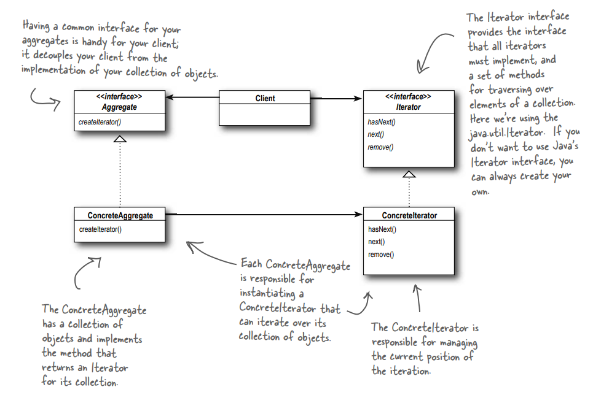
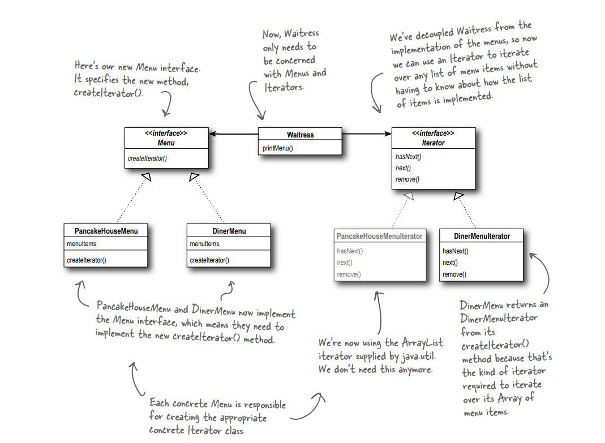
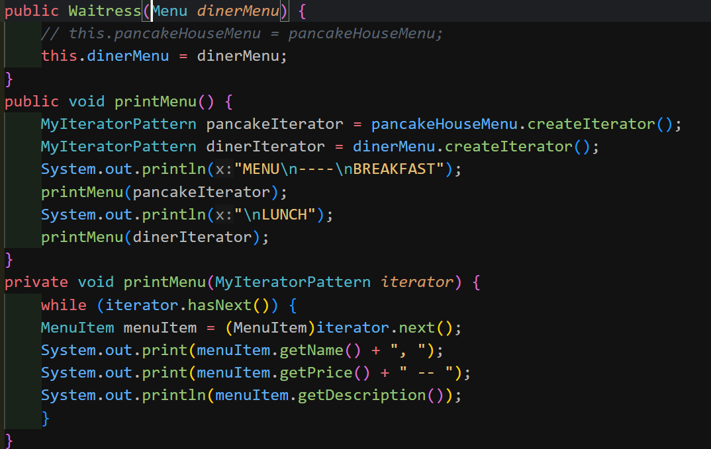

# Iterator Design Pattern

## definition:

The Iterator Pattern provides a way to access the elements of an aggregate object
sequentially without exposing its underlying representation.

## when to use?

Provide a way to access the elements of an aggregate object
sequentially without exposing its underlying representation(that mean without ever getting a peek at how you store your objects).

## Some notes about this pattern:

-- An Iterator allows access to an aggregate’s elements without exposing its internal structure. 
-- An Iterator takes the job of iterating over an aggregate and encapsulates it in another
object. 
-- When using an Iterator, we relieve the aggregate of the responsibility of supporting operations for traversing its data. 
-- An Iterator provides a common interface for traversing the items of an aggregate, allowing you to use polymorphism when writing code that makes use of the items of the aggregate. 
-- We should strive to assign only one responsibility to each class. 

## And we have two types of iterators:

### Internal Iterator:

An internal iterator is controlled
by the iterator itself.

### External Iterator:

An external iterator which means that the client controls the
iteration by calling next() to get the next
element.

### So Internal iterators are less flexible that external iterators.

## The general UML diagram for Iterator Pattern:

## Let's take an example() about the Iterator pattern:

### The UML Diagram For this example:

### The details About this example:

1. We have an iterator interface that has methods that help me during iteration, like hasNext() and next(). 
2. For every new type of iterator, we must implement the iterator interface, such as DinerMenuIterator (which iterates over an array) and PancakeHouseMenuIterator (which iterates over an ArrayList). 
3. And we have a Menu interface that has a createIterator method that returns a MyIterator pattern. So, for every new menu, we will add a new iterator. 
4. And we have a class MenuItem that contains details(price, name, description and vegetarian) about any item on the menu. 
5. In the class waitress, we take a specific menu and create an iterator of this menu type. To understand more, look at this code. 

6. And any structure you use to create a new menu will be an instance of the MenuItem class.
