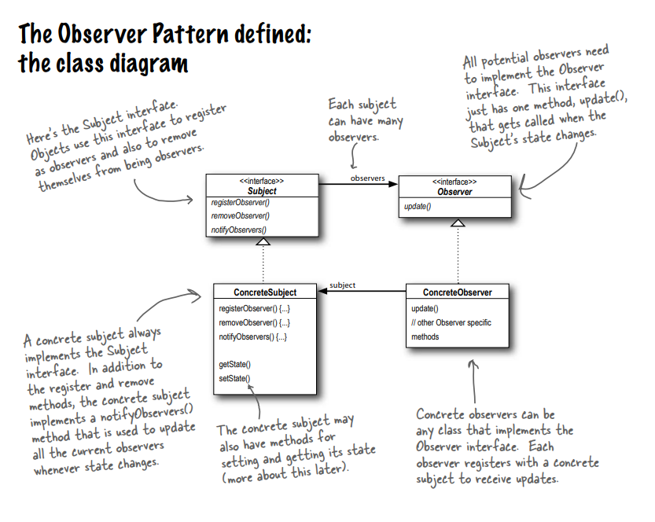
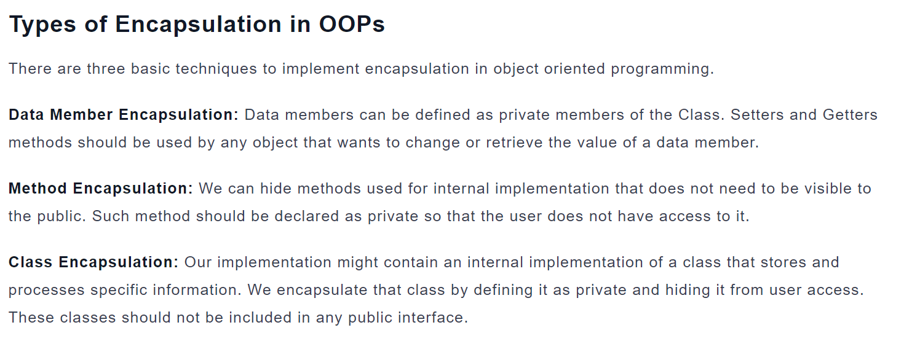
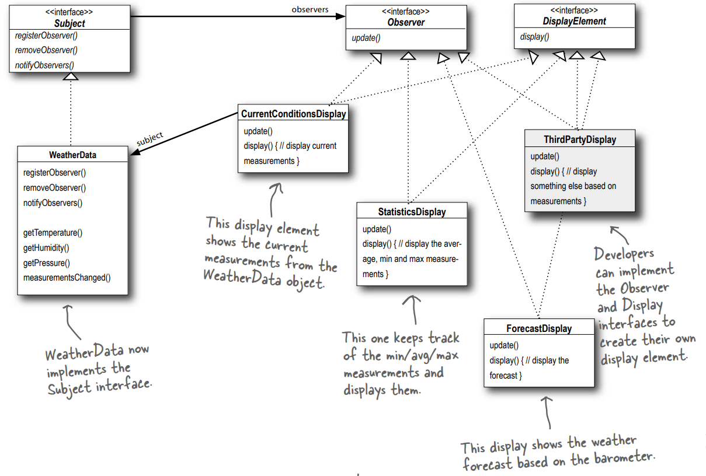

# Observer Design Pattern

## Definition:

defines a one-to-many dependency between objects so that when one
object changes state, all of its dependents are
notified and updated automatically.

observer design pattern = observer --> (will be updated with the subject) + subject(observable) --> (is waiting for new changes)

## Some notes about this pattern:

-- Subjects, or as we also know them, Observables, update Observers using a common interface. 
-- Observers are loosely coupled in that the Observable knows nothing about them, other than that they implement the Observer Interface. 
-- You can push or pull data from the Observable when using the pattern (pull is considered
more “correct”). 
-- Don’t depend on a specific order of notification for your Observers. 

## some principles about this pattern:

-- Strive for loosely coupled designs between objects that interact. 

## UML diagram:

## Let's talk about Encapsulation (It is considered one of the important concepts of OOP) again

## Let's take an example(Weather App) of the observer design pattern:

### UML Diagram:

### Details About Weather app:

We want to build an Weather app. This app has data about the weather and updates it constantly

-- We have a subject class (observable). This class is responsible for notifying observers, removing observers, and registering observers."The WeatherData class implements the Subject interface and includes some concrete methods, including the getMeasurementsChanged method and getter methods. The measurementsChanged method is used to capture new changes in the weather. 

-- We have an Observer class that is responsible for updating all types of observers, including CurrentConditionsDisplay, StatisticsDisplay, and ForecastDisplay. 

-- we have interface(DisplayElement) for displaying weather information, including CurrentConditionsDisplay, StatisticsDisplay, and ForecastDisplay. 

Why is the DisplayElement class an interface?
Ans: We have different types of observers. 
