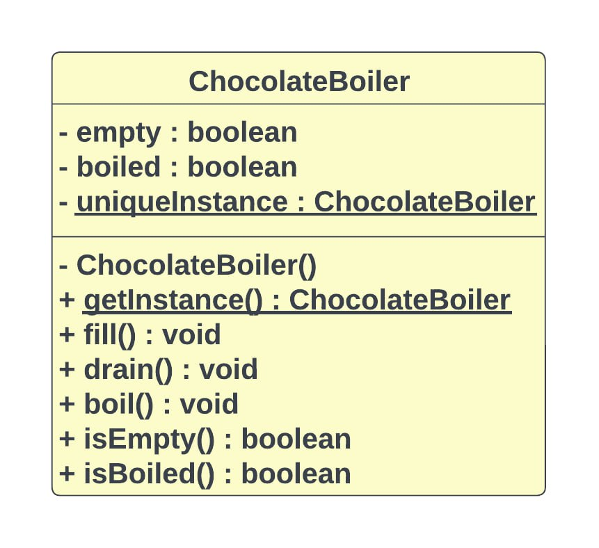

# Singleton Pattern

## Definition:

The Singleton Pattern is a design pattern used in software engineering to ensure that a class has only one instance and provides a global point of access to that instance. While it's true that static methods are often used to implement the Singleton Pattern, it's not the only way to implement it.

## definition of static methods:

A static method is a method that belongs to a class rather than an instance of a class. This means you can call a static method without creating an object of the class. Static methods are sometimes called class methods.

## Some notes about this pattern:

-- The Singleton Pattern ensures you have at most one instance of a class in your application. 
-- The Singleton Pattern also provides a global access point to that instance. 
-- Java’s implementation of the Singleton Pattern makes use of a private constructor, a static method combined with a static variable. 

## Let's take an example(The Chocolate Factory) of the Singleton design pattern:

### UML Diagram:

And Check Code.
