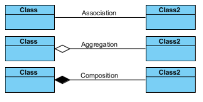
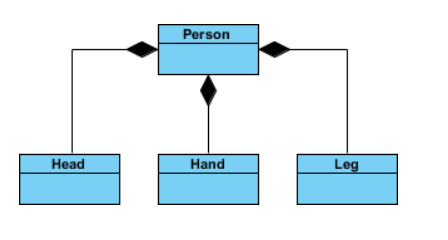
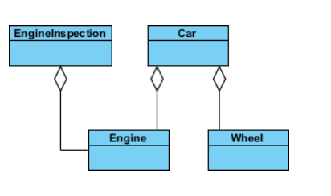
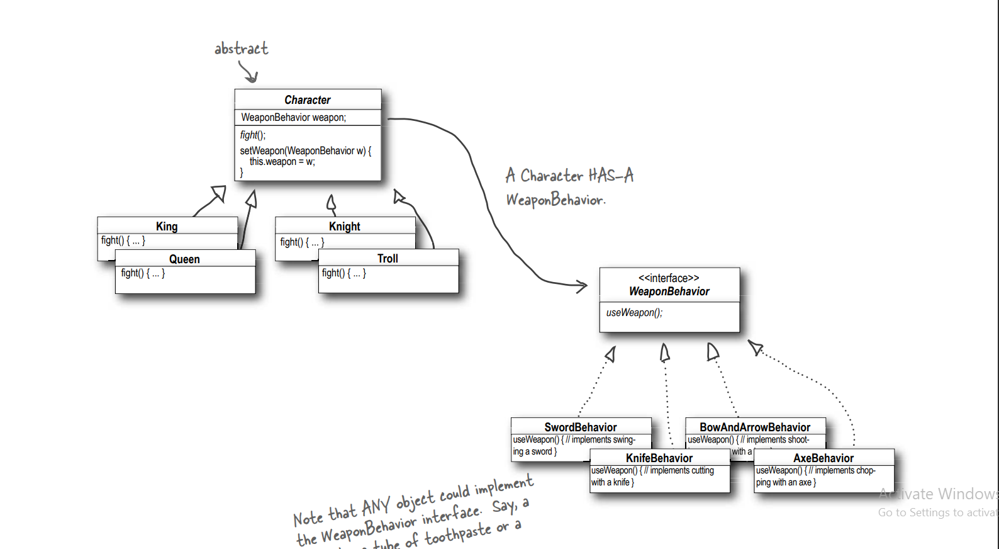

# Strategy Design Pattern

The Strategy Pattern defines a family of algorithms,
encapsulates each one, and makes them interchangeable.
Strategy lets the algorithm vary independently from
clients that use it.

## The reason to use Strategy Design pattern

Strategy pattern is useful when we have multiple algorithms for specific task and we want our application to be flexible to chose any of the algorithm at runtime for specific task

## some principles about this pattern(OO Principles):

-- Encapsulate what varies. 
-- Favor composition over inheritance. 
-- Program to interfaces, not implementations. 

## Details about relationship that use in strategy design pattern

In this pattern favor composition over inheritance so we will talk about composition, difference between (aggregation and composition) and association

To understand different between them in UML diagram:

first --> composition and aggregation are specific cases of association

second --> Definition of association :a group of persons who share common interests or a common purpose and who are organized with varying degrees of formality.

Example about it:

third --> Definition of composition:
implies a relationship where the child cannot exist independent of the parent. Example: House (parent) and Room (child). Rooms don't exist separate to a House.

Example about composition:

In this example:
(Hand, Leg and Head) depend on a person if not a person no (Hand, Leg and Head) and person depend on (Hand, Leg and Head).

forth --> Definition of aggregation:
implies a relationship where the child can exist independently of the parent. Example: Class (parent) and Student (child). Delete the Class and the Students still exist.

Example about aggregation:

In this example:
wheel not depend on a car but car depend on wheel.

## In our example about Strategy design Pattern:

### UML Diagram

### Details of our example:

-- Interface weapon that have a family of algorithms(Weapon). 
-- Abstract Class that is use a family of algorithms(Character). 
-- Weapon defines a family of algorithms encapsulates each one(Sword, knife, Axe and (Bow and Arrow)). 
-- Each Character inherit from Character Class And use one of Weapon algorithms. 
