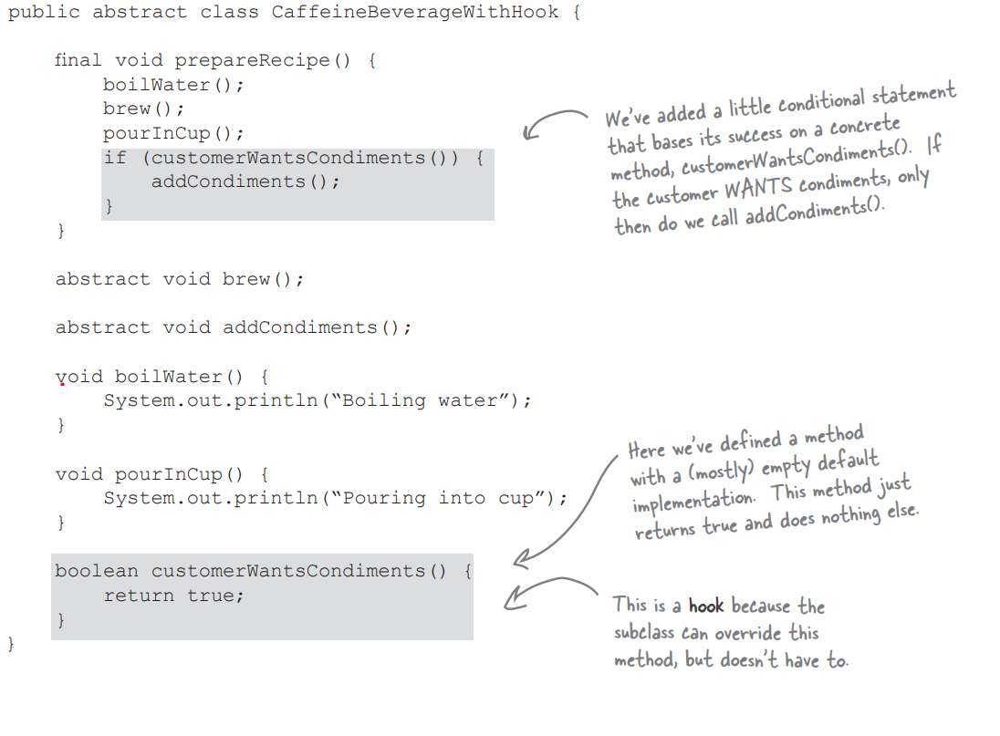
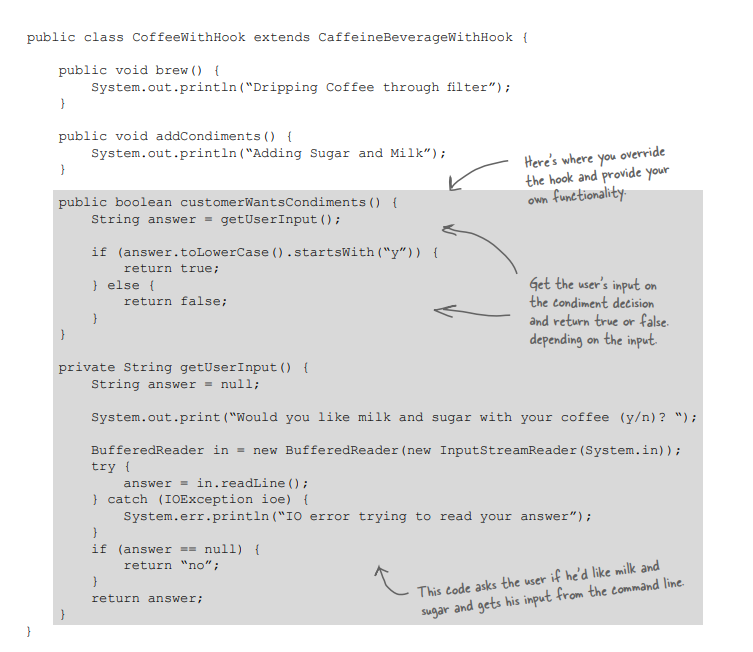
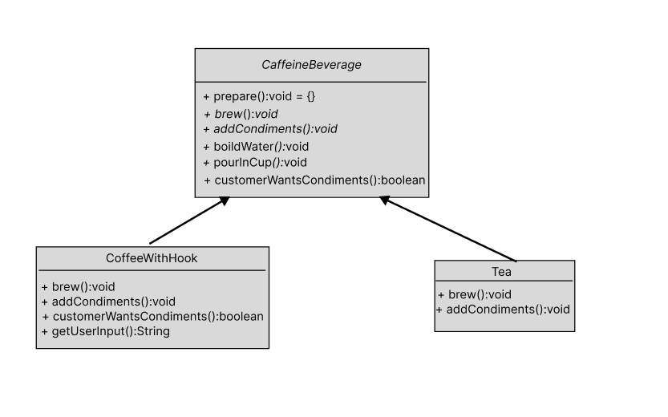

# Template Method Pattern

## Definition:

The Template Method Pattern defines the skeleton of an algorithm in a method, deferring some steps to subclasses. Template Method lets subclasses redefine
certain steps of an algorithm without changing the algorithm’s structure.

## Some principles about this pattern(The Hollywood Principle):

### Don’t call us, we’ll call you.

This principle related to the Dependency Inversion Principle.

This principle gives us a way to prevent dependency rot(Dependency rot happens when you have high-level components depending on low-level components depending on high-level components depending on sideways components depending on low-level components, and so on). 

So This principle allow low level components to hook themselves into a system.
but the high-level components determine when they are needed, and how. In
other words, the high-level components give the low-level components a **“don’t call us, we’ll call you”** treatment.

## Some notes about this pattern:

-- A template method defines the steps of an algorithm, deferring to subclasses for the
implementation of those steps. 
-- The Template Method Pattern gives us an important technique for code reuse. 
-- The template method’s abstract class may define concrete methods, abstract
methods and hooks. 
-- Abstract methods are implemented by subclasses. 
-- Hooks are methods that do nothing or default behavior in the abstract class, but may be
overridden in the subclass. 
-- To prevent subclasses from changing the algorithm in the template method, declare the
template method as final. 
-- The Hollywood Principle guides us to put decision-making in high-level modules that can
decide how and when to call low level modules. 
-- The Strategy and Template Method Patterns both encapsulate algorithms, one by inheritance(Template method) and one by composition(strategy).
-- The Factory Method is a specialization of Template
Method. 

## Let's discuss the use of hooks in software development:

### Definition:

A hook is a method that is declared in the provides a default implementation.abstract class, but only given an empty or default implementation. This gives subclasses the ability to “hook into” the algorithm at various points.

### What hooks are used?

1)A hook may provide a way for a subclass to implement an optional part of an algorithm. 
2)A hook can also provide a subclass with the ability to make a decision for the abstract class. 

### Let's take an example of it:

#### In this image the hook(customerWantsCondiments) that is return true ==> default.

#### In this image, the subclass will determine whether I will add condiments.

## Let's take an example of the Template Method design pattern:

### UML Diagram:

### I would like to provide details about an example of the Template Method Pattern:

-- We have an abstract class, CaffeineBeverage, that has a template method called prepare(), which defines a **final method**. 
-- Q) What is a final method? 
-- A) **The final method** in an abstract class doesn't allow subclasses to change its implementation. 
-- In this abstract class, we provide concrete (implemented) methods(boildWater() and pourInCup()) that are common to all its subclasses. 
-- We have a hook method (customerWantsCondiments()) that always returns true if the subclass does not modify it, as is the case with the Tea class. However, CoffeeWithHook modifies this method, resulting in the removal of the implementation in the abstract class and the introduction of a new implementation. 
-- In the Tea and CoffeeWithHook classes, which extend the CaffeineBeverage class, all abstract methods in the CaffeineBeverage class (brew() and addCondiments()) are overridden.
